# 🧠 App de productividad personal

Aplicación desarrollada en **Retool** y conectada a **PostgreSQL**, pensada para ayudarte a dejar la procrastinación, construir buenos hábitos, organizar tu día y alcanzar objetivos a largo plazo.  
Este proyecto automatiza la gestión de tareas, hábitos, metas, lectura y sueño, con visualización de datos en tiempo real.

---

## ✨ Funcionalidades principales

### 💬 Motivación diaria
- Mensajes motivadores para dejar la procrastinación y empezar el día con ánimo.
- Enfoque en crear hábitos sólidos y sostenidos en el tiempo.

### 🔁 Seguimiento de hábitos (positivos y negativos)
- Agrega hábitos positivos como tomar agua, leer, lavarte los dientes o comer fruta.
- Define cuántas veces debes hacerlos por día y regístralos con un contador (`+`).
- También puedes agregar hábitos negativos que deseas dejar (como comerte las uñas), registrando cuándo fallas.
- Registro diario para controlar avances y retrocesos.

### 📝 Tareas diarias automatizadas
- Crear tareas con título, descripción, prioridad, estado,  hora de inicio y término.
- A las 00:00, las tareas se reinician automáticamente:
  - Las tareas en estado pendiente pasan al historial como “no completadas”.
  - Las tareas completadas se guardan como completadas en el historial.
- Función de “copiar tareas desde el calendario” para no reescribir todos los días las tareas.
- Funcion de editar y eliminar las tareas.

### 🎯 Objetivos mensuales y anuales
- Crea objetivos con fechas límite.
- Al llegar la fecha, se trasladan al historial automáticamente.
- Puedes vincular tus tareas diarias a metas de mayor plazo.

### 📚 Control de lectura
- Registra los libros que estás leyendo o que ya leíste.
- Ingresa el número de páginas y el plazo para terminarlos.
- Calcula cuántas páginas debes leer por día para cumplir tu meta.
- Tabla de registro para anotar cuánto leíste cada día.

### 📊 Estadísticas semanales
- Historial de tareas que muestra:
  - Completadas ✅
  - Pendientes 🕒
  - No completadas ❌
- Gráficos automáticos para evaluar tu progreso semanal y motivarte.

### 😴 Control de sueño
- Registra cuántas horas dormiste cada día.
- Visualización en gráfico para tomar conciencia de tu descanso.
- Reflexión visual sobre la necesidad de mejorar tus hábitos de sueño.

---

## 🛠️ Tecnologías utilizadas

- **Retool** – Creación de la interfaz y lógica condicional
- **PostgreSQL / Supabase** – Gestión de datos y automatizaciones
- **SQL** – Consultas dinámicas, filtros y generación de gráficos
- **JavaScript** – Automatización y validaciones internas
- **Moment.js** – Manejo y formateo de fechas

---

## 📸 Capturas del proyecto

### 🧠 Consejos motivacionales
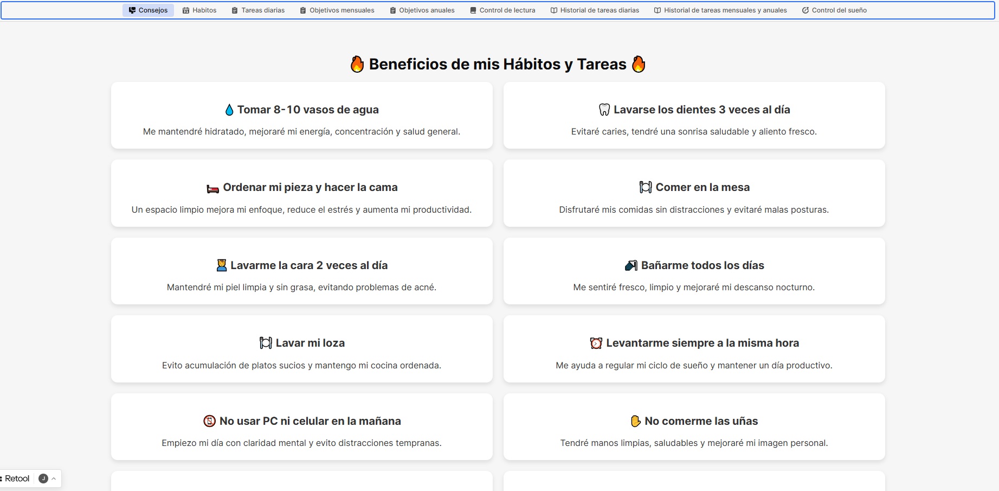

### 🔁 Hábitos positivos y negativos
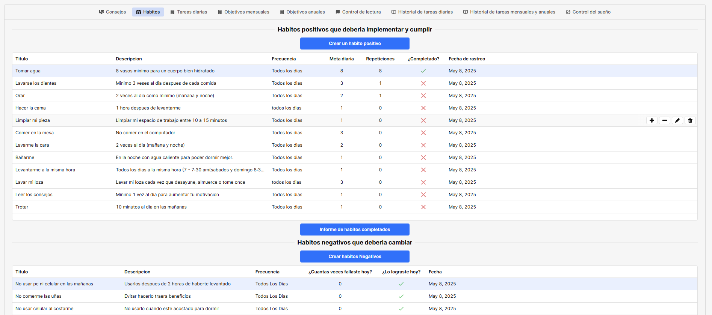

### 📊 Informe histórico de hábitos
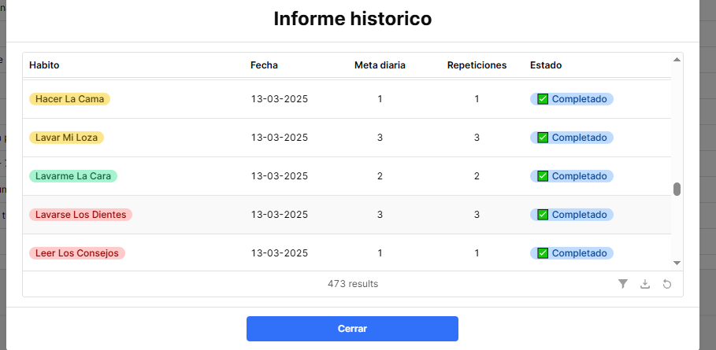

### 📝 Agregar tarea diaria
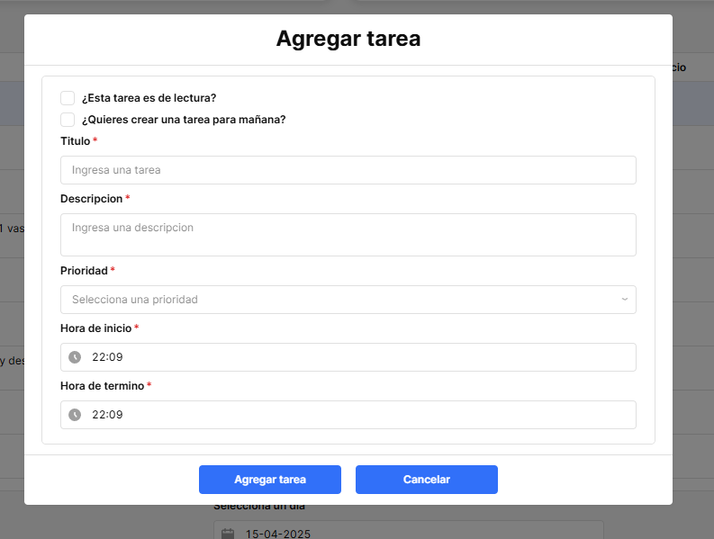

### 📅 Duplicar tareas anteriores
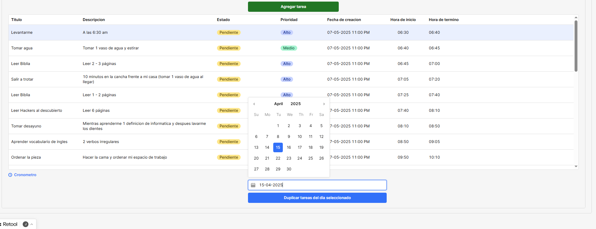

### ✅ Tareas diarias 
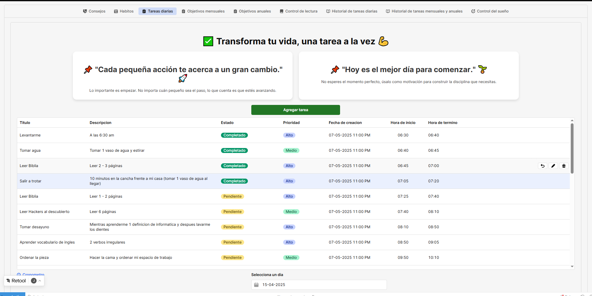

### 📖 Agregar libro nuevo
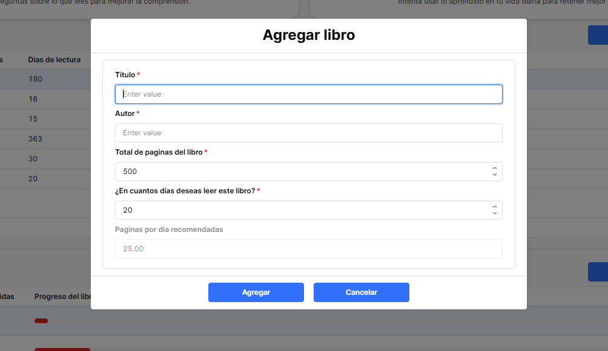

### 📚 Tabla de control de lectura
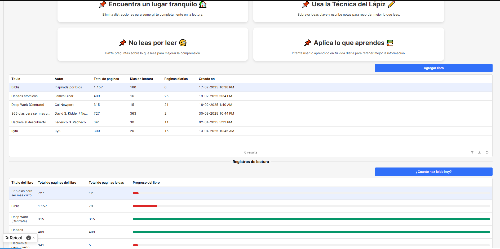

### 📅 ¿Cuánto leíste hoy?
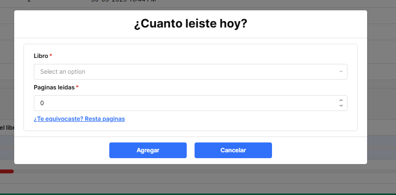

### 🎯 Objetivos mensuales
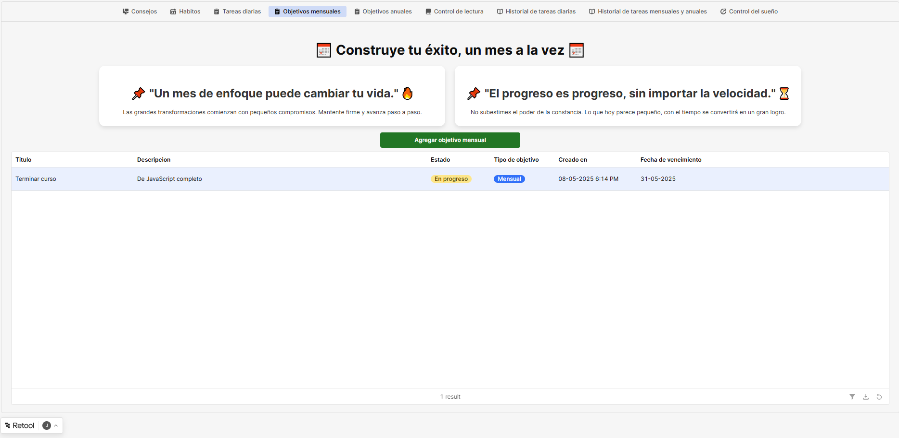

### 🏆 Objetivos anuales
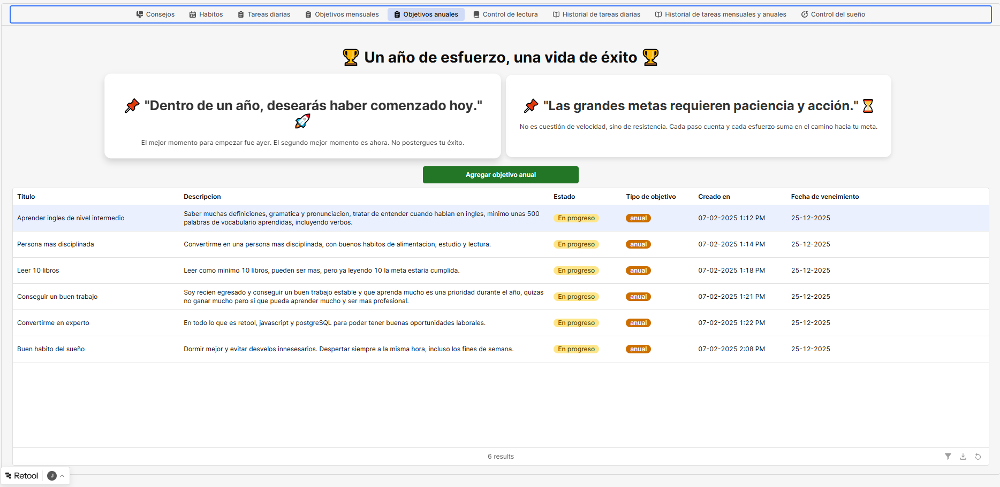

### 📂 Historial de tareas diarias
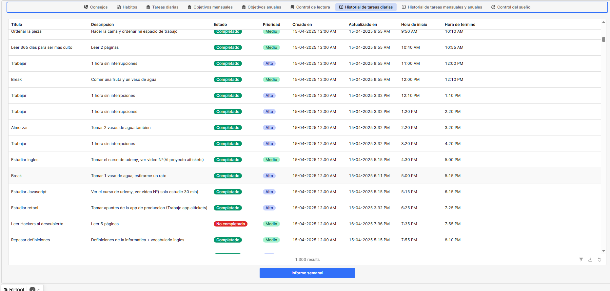

### 📅 Historial de objetivos cumplidos y pendientes
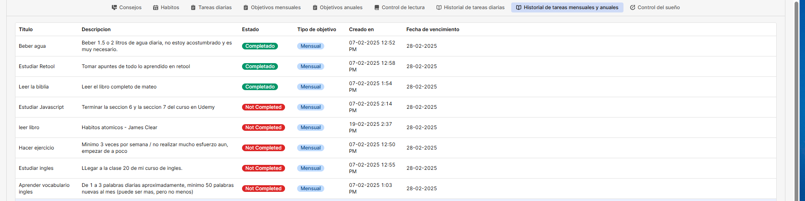

### 🌙 Agregar horas de sueño

### 😴 Control de sueño + gráfico
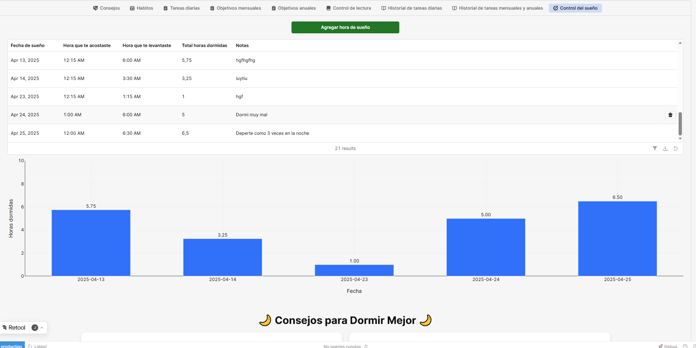

---

💬 Si te interesa usar o ver una demo de esta app, ¡no dudes en escribirme o revisar el código/documentación!

